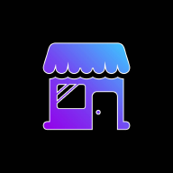

APP Loja Virtual
==========
## Um projeto Flutter

<p float="middle">
  
</p>

# Índice

* [Índice](#índice)
* [Status do Projeto](#status-do-projeto)
* [Descrição do Projeto](#descrição-do-projeto)
* [Acesso ao Projeto](#-acesso-ao-projeto)
* [Requisitos](#-requisitos)
* [Funcionalidades do Projeto](#-funcionalidades-do-projeto)
* [Executar o Projeto](#-executar-o-projeto)
* [Autores](#-autores)

# Status do Projeto


# Descrição do Projeto

Este projeto foi desenvolvido como parte do meu estudo no framework Flutter. Eu estava curioso para aprender como desenvolver um aplicativo móvel, então comecei a estudar e desenvolver vários aplicativos para melhorar. Este foi o melhor e maior projeto que já fiz, porque usei quase todo o conhecimento que aprendi. Tentei me concentrar muito na beleza do aplicativo e oferecer o máximo de funções possível, como contas, banco de dados, localização, chat, compras falsas e outras coisas. Posso dizer que realmente foi um aplicativo completo.

# 📁 Acesso ao Projeto

**Está disponível no Github: "https://github.com/GuiQueirozRibeiro/App_Loja_Virtual"**

# 📝 Requisitos

- ## Instale o DartSDK em sua máquina

**https://dart.dev/get-dart**

- ## Instale o FlutterSDK em sua máquina

**https://docs.flutter.dev/get-started/install**
 
- ## Instale e configure o Android Studio em sua máquina

**https://developer.android.com/studio**

- ## Crie uma conta no Google Maps para usar a API

**https://mapsplatform.google.com/**

- ## Crie uma conta no Firebase

**https://firebase.google.com/?hl=pt**

# 🔨 Funcionalidades do Projeto

- `Funcionalidade 1`: imagem do ícone
- `Funcionalidade 2`: tela de splash
- `Funcionalidade 3`: compatível com dispositivos IOS e Android
- `Funcionalidade 4`: favoritar seus produtos
- `Funcionalidade 5`: criar um produto usando a câmera ou uma imagem na internet
- `Funcionalidade 6`: usar a localização para preencher os dados do produto
- `Funcionalidade 7`: criar uma conta onde os dados são salvos para cada usuário
- `Funcionalidade 8`: comprar os produtos e ver o histórico de pedidos posteriormente
- `Funcionalidade 9`: conversar com o criador do produto

# ▶ Executar o Projeto

- `Para executar o programa, use:`

```console
flutter run
```

# 👨‍💻 Autores

| [<br><sub>Guilherme Queiroz Ribeiro</sub>](https://github.com/GuiQueirozRibeiro)
| :---: |

### Fim

Para obter ajuda para começar a desenvolver com o Flutter, consulte a
[documentação online](https://docs.flutter.dev/), que oferece tutoriais,
exemplos, orientações sobre desenvolvimento móvel e uma referência completa da API.
